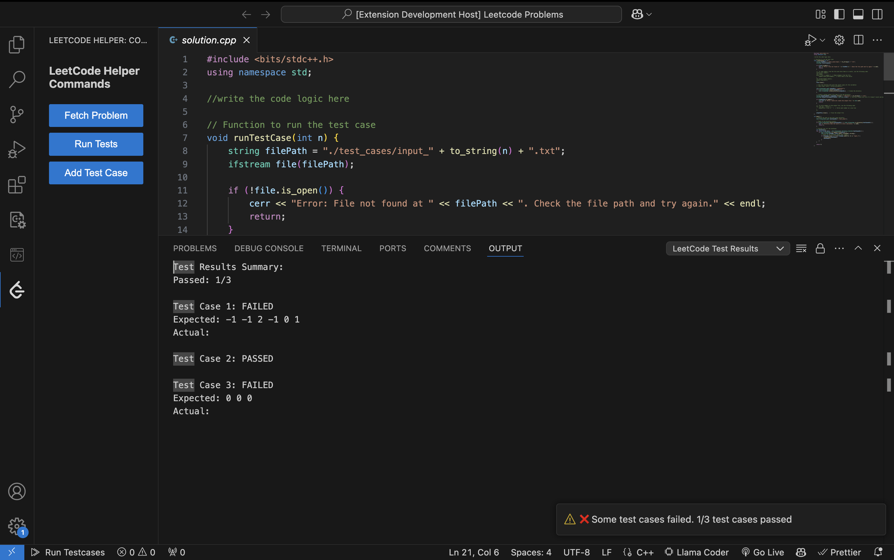

# LeetCode Helper VSCode Extension

A powerful VSCode extension designed to streamline your LeetCode problem-solving workflow by automating test case management and providing an integrated development environment.

## Features

### 1. Problem Fetching
- Automatically fetch problems from LeetCode using the problem slug
- Support for multiple programming languages (C++, Python, JavaScript)
- Creates a structured project directory with:
  - Solution file with language-specific boilerplate code
  - Test cases directory with example test cases
  - Organized output directory for test results

### 2. Test Case Management
- Automatically extracts and saves example test cases from LeetCode problems
- Supports adding custom test cases through a simple interface
- Maintains separate directories for input and output test cases
- Automatically numbers and organizes test cases

### 3. Test Execution
- One-click test execution for all test cases
- Supports compilation and execution for multiple languages
- Real-time test results with detailed output
- Clear pass/fail indicators for each test case
- Comprehensive error reporting

### 4. User Interface
- Integrated sidebar with easy access to all commands
- Keyboard shortcuts for common operations
- Progress notifications during operations
- Detailed output channel for test results
- Clean and intuitive command interface

*LeetCode Helper extension showing solution.cpp file with test results output and sidebar commands*

## Implementation Overview

### Architecture
- Written in TypeScript for type safety and better maintainability
- Modular design with clear separation of concerns:
  - `extension.ts`: Main extension activation and command registration
  - `fetchQuestion.ts`: LeetCode API interaction and problem fetching
  - `languageConfig.ts`: Language-specific configurations and templates
  - `runTestCases.ts`: Test execution and result comparison
  - `addTestCase.ts`: Custom test case management
  - `SidebarProvider.ts`: UI components and webview management

### Key Components

1. **Problem Fetcher**
   - Uses GraphQL API and axios to fetch problems from LeetCode
   - Extracts example test cases using regex
   - Creates structured directories and files

2. **Language Support**
   - Configurable language templates
   - Compile and run command management
   - Extension to language mapping

3. **Test Runner**
   - Asynchronous execution of test cases
   - Support for compiled and interpreted languages
   - Detailed result comparison and reporting

4. **User Interface**
   - WebView-based sidebar
   - VS Code native UI integration
   - Progress notifications and output channels

## Technical Challenges and Solutions

1. **Test Case Parsing**
   - Challenge: Extracting test cases from HTML content
   - Solution: Robust regex patterns with HTML entity handling

2. **Multi-language Support**
   - Challenge: Different compilation and execution requirements
   - Solution: Configurable language templates with standardized interface

3. **File Path Handling**
   - Challenge: Spaces and special characters in paths
   - Solution: Path wrapping and proper escaping

4. **Asynchronous Operations**
   - Challenge: Managing multiple async operations
   - Solution: Promise-based execution with proper error handling

## Future Improvements

1. **Enhanced Language Support**
   - Add support for more programming languages
   - Implement language-specific optimizations
   - Add custom template support

2. **Advanced Test Features**
   - Performance metrics for solutions
   - Memory usage tracking
   - Time complexity analysis
   - Test case generation using AI

3. **UI Enhancements**
   - Interactive test case editor
   - Visual test result display
   - Problem description preview
   - Solution history tracking

4. **Integration Features**
   - LeetCode account integration
   - Problem submission directly from VSCode
   - Progress tracking and statistics
   - Code snippet library

## Installation

1. Clone the repository
2. Install dependencies: `npm install`
3. Build the extension: `npm run compile`
4. Launch with VSCode debugging

## Commands

- `CPH.fetchProblem`: Fetch a new LeetCode problem
- `CPH.runTestCases`: Run all test cases for current solution
- `CPH.addTestCase`: Add a custom test case

## Keyboard Shortcuts

- Fetch Problem: `cmd+shift+f`
- Run Test Cases: `cmd+shift+r`
- Add Test Case: `cmd+shift+a`

## Requirements

- VSCode ^1.96.0
- Node.js
- Compilers/interpreters for supported languages (g++, python3, node)
